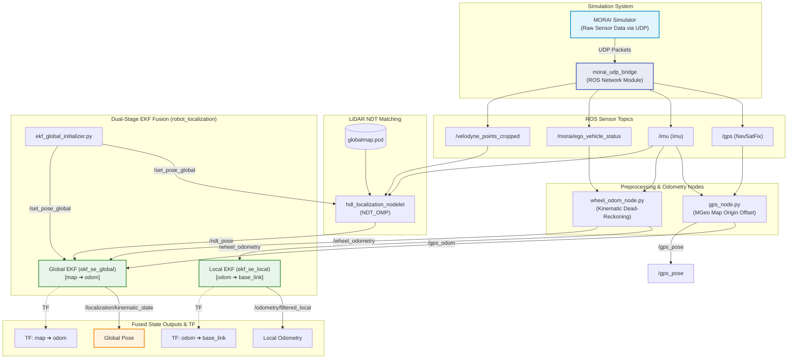
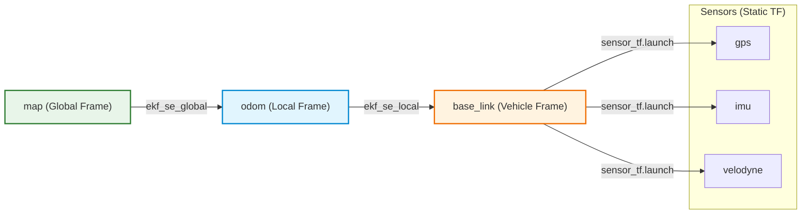

# 03_localization — 위치 추정 (Localization Stack)

MORAI 시뮬레이터 환경에서 **GPS, IMU, Wheel Odometry, LiDAR NDT** 데이터를 센서 융합(Sensor Fusion)하여 차량의 정밀 전역/지역 위치를 추정하는 위치 추정 프레임워크입니다.

---

## 1. 전체 프레임워크 구조 (Localization Framework)



---

## 2. TF (TransForm) 좌표계 변환 구조



---

## 3. 주요 구성 요소 (Components)

| 모듈/노드 | 역할 및 기능 | 주요 입출력 |
|-----------|--------------|-------------|
| **`gps_node.py`** | MORAI GPS 수신, MGeo `global_info.json` 원점 기준 UTM 좌표 변환 | **In:** `/gps`, `/imu`<br>**Out:** `/gps_pose`, `/gps_odom` |
| **`wheel_odom_node.py`** | Ego 차량 속도(`signed_vel`) 및 IMU 헤딩 기반 Dead Reckoning 계산 | **In:** `/morai/ego_vehicle_status`, `/imu`<br>**Out:** `/wheel_odometry` |
| **`ekf_global_initializer.py`** | 최초 GPS/IMU 수신 시 Global EKF 및 NDT 초깃값 자동 주입 | **Out:** `/set_pose_global`, `/initialpose` |
| **`ekf_se_local`** | Wheel Odom + IMU 고속 로컬 융합 (드리프트 억제) | **Out:** TF `odom` → `base_link`, `/odometry/filtered_local` |
| **`hdl_localization`** | LiDAR Point Cloud와 사전 등록된 PCD 지도 NDT 맵 매칭 | **In:** `/velodyne_points_cropped`, `/globalmap`<br>**Out:** `/ndt_pose` |
| **`ekf_se_global`** | GPS Odom + NDT Pose + Wheel Odom 최종 글로벌 위치 융합 | **Out:** TF `map` → `odom`, `/localization/kinematic_state` |

---

## 4. 패키지 구성

| 패키지 | 설명 | 출처 |
|--------|------|------|
| `localization` | EKF 기반 GPS/Odom/NDT 융합 로컬라이제이션 스택 및 전처리 노드 | 자체 개발 |
| `hdl_localization` | HDL Graph SLAM 기반 3D LiDAR NDT 맵 매칭 노드 | GitHub (koide3) |
| `ndt_omp` | OpenMP 기반 Multi-thread NDT 가속 라이브러리 | GitHub |
| `fast_gicp` | GICP/NDT 고속 정렬 C++ 라이브러리 | GitHub |

---

## 5. 빠른 시작 (Quick Start)

```bash
# 1. 전체 Global Localization 스택 실행 (GPS + Wheel Odom + NDT + Dual EKF)
roslaunch localization localization_global.launch

# 2. Local Localization 스택만 실행 (Wheel Odom + IMU EKF)
roslaunch localization localization_local.launch

# 3. NDT 맵 매칭 단독 실행
roslaunch localization ndt_localization.launch
```
